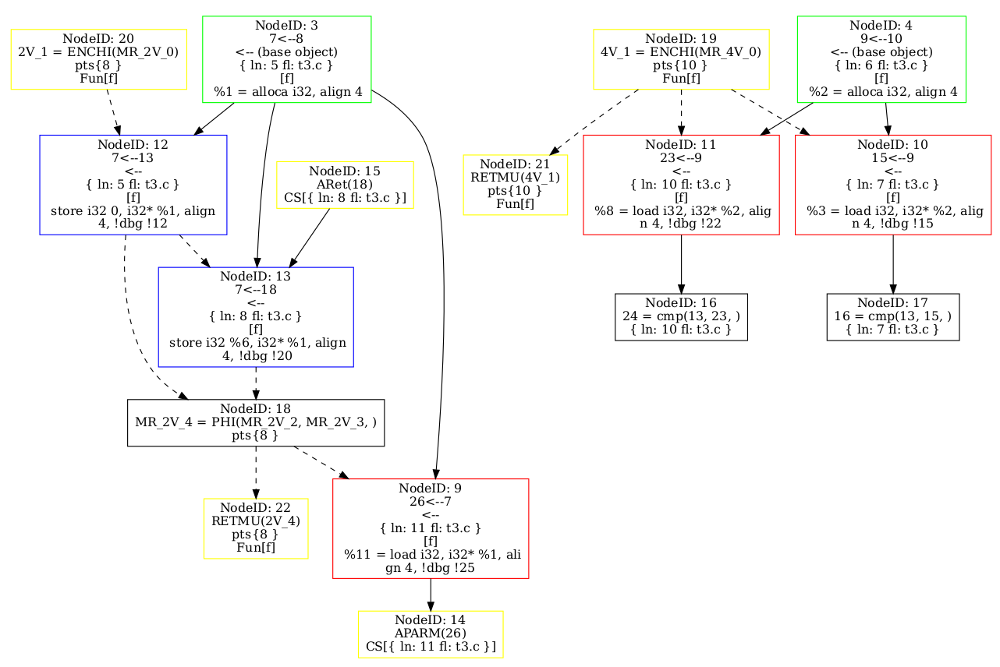
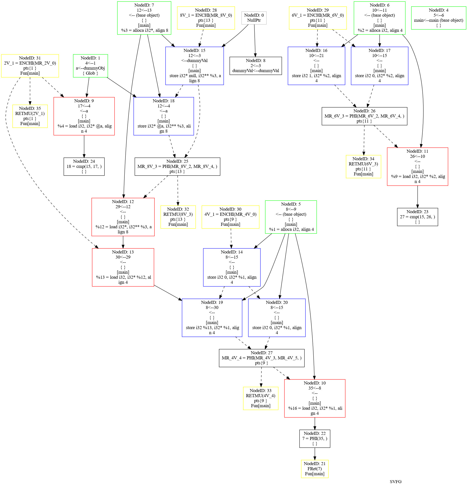
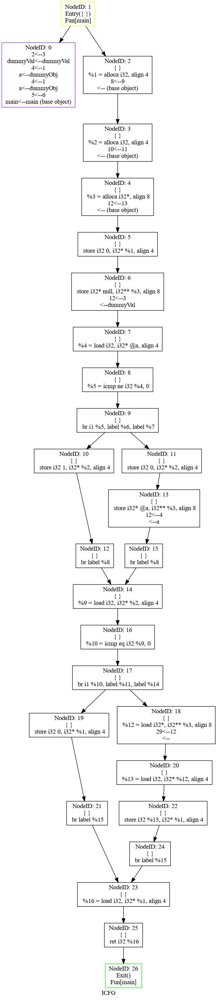
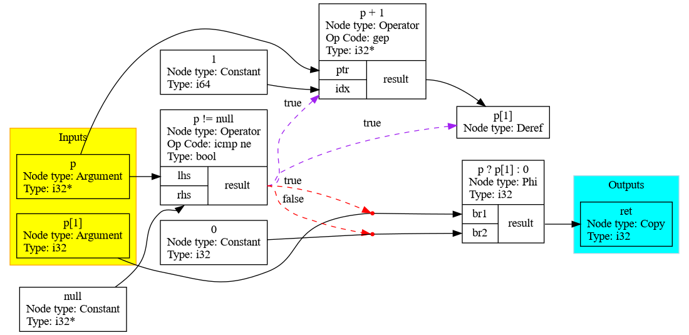

# Reachability Checker for SVF

## Problem statement

Given a $(Source, Sink)$ pair in SVFG (which possibly implies a potential defect), check whether there is a feasible control flow path that produces a def-use chain starting from $Source$ and ending at $Sink$.

Notice that the path is given as a value flow sequence but there may exist conflicting control flow conditions (ignored in SVFG) which make the path infeasible.

### Example
Consider the following code snippet.

```c
extern int source();
extern void sink(int x);

void f() {
    int x = 0;
    int c;
    if (c) {
        x = source();
    }
    if (!c) {
        sink(x);
    }
}
```

The generated SVFG:


A source-sink path $\pi_0$ is `N15 -> N13 -> N18 -> N9 -> N14`.

However, `N13` is control dependent on the condition `c` (i.e., `N17 == True`) while `N14` is control dependent on the condition `!c` (i.e., `N16 == False`). Since `N16 == N17`, the path $\pi_0$ is *infeasible*.

We want an algorithm that:

1. analyze the trace of $\pi_0$ and collect relevant conditions: $N_{17} \land \neg N_{16} \land N_{17} = N_{16}$.
2. feed these conditions to Z3 and check their feasibility.

Realistic scenarios will be much complex.

## Lesson from Saber

We investigated a related approach implemented in Saber.

### Understanding the algorithm of Saber

Saber construct conditions from SVFG and LLVM CFG.

Hereinafter, the following notation is used:
* $\mathsf{VfCond}$ denotes related condition in SVFG
* $\mathsf{CfCond}$ denotes related condition in LLVM CFG.

The definition of $\mathsf{VfCond}$ uses $\mathsf{CfCond}$ and both of them employ recursive definition.

#### Control flow condition

$\mathsf{CfCond}$ is a map $BB \to Cond$ which is parameterized by $src$. $\mathsf{CfCond}_{src}(t)$ is the control flow conditions from $src$ to $t$. The subscript $src$ is omitted while no ambiguity is caused. It is recursively defined as follows:

$$
\left\{
\begin{array}{rcll}
\mathsf{CfCond}(t) &:=& \mathsf{True} & t = src\\
\mathsf{CfCond}(t) &:=& \mathsf{False} & \textrm{while $t$ is not reachable from $src$ in CFG}\\
\mathsf{CfCond}(t) &:=& \bigvee_{s\in \mathsf{Pred}(t)} \mathsf{CfCond}(s) \land \mathsf{BranchCond}(s, t) & \textrm{otherwise}\\
\end{array}
\right.
$$

On conditional branching, a BB may have multiple (ordered) successors. The $\mathsf{BranchCond}$ of $i$-th branch is formulated as $Symbol(s)=i$. For unconditional branching, $\mathsf{BranchCond}(s, t)$ is $\mathsf{True}$. $Symbol(s)$ is the unique symbol assigned to $s$.

In this way, Saber ensures the control flow path does not take different branch on the same branching node.

When $s$ is post dominated by $t$, the condition $\mathsf{CfCond}_s(t)$ is always satisfiable. In practice, $\mathsf{CfCond}_s(t)=\mathsf{True}$ is used.

#### Value (+Control) flow condition

$\mathsf{VfCond}$ is a map $SVFNodes \to Cond$ parameterized by $source \in SVFNodes$. $\mathsf{VfCond}_{source}(t)$ is the value flow dependency combined with control flow condition of control flow path from $\mathsf{BB}(source)$ to $\mathsf{BB}(t)$. It is recursively defined as follows:

$$
\left\{
\begin{array}{rcll}
\mathsf{VfCond}(t) &:=& \mathsf{True} & t = source\\
\mathsf{VfCond}(t) &:=& \mathsf{False} & \textrm{while $t$ is not reachable from $source$ in SVFG}\\
\mathsf{VfCond}(t) &:=& \bigvee_{u\in \mathsf{Pred}(v)} \mathsf{VfCond}(u) \land \mathsf{CfCond}(\mathsf{BB}(v), \mathsf{BB}(u)) & \textrm{otherwise}\\
\end{array}
\right.
$$

$\mathsf{BB}(u)$ is the corresponding LLVM CFG node (aka basic block) of SVFG node $u$.

#### Handling loop
Basically, Saber employs worklist based graph search to collect conditions on branching nodes. Reaching path conditions are disjuncted on each BB and the traversal terminates when path condition saturates. The traversal must stop because there is finite number of path conditions.

#### Path condition of program slice
Path condition of a program slice (single source with multiple sink) is:

$$
\bigvee_{sink\in sinks}\mathsf{VfCond}(sink; source)
$$

### Limitation of Saber's approach

It seems that Saber consider very few value constraints on control flow path, although some special cases (such as null pointer comparison) are treated accordingly. It essentially checks for graph reachability (which is useful when checking defects such as double free). It is better that value constraints are taken into consideration.

## Reachability checking algorithm

Z3 can be employed to encode more sophisticated path condition. The real difficulty is in construction of path condition.

### A naive approach on ICFG

The key point of our approach is to encode values relations into path condition.

!Formalization!

backward

comprehensive search

#### Handling of loop

#### Removing of irrelevant conditions

Now $\mathsf{BranchCond}$ contains variables, we need to find the real value of variables and construct formulas. But the variables may have multiple definitions. These definitions can be found in SVFG. To decide which definition is finally used, we need to verify the reachability of the path from definition to use. Note this path may contain some extra copy-semantic nodes like PHI and Return. If the definition comes from an operator-semantic node like Add Instruction, we need to recursively find the definition of variables and validate the reachability for each of its operators, and construct the formula with this operator. During the process of validating the reachability, the conditions of the def-use paths may involve more variables which again require the process of identifying their value.

#### A Fatal Problem in Finding Conditions in ICFG

```c {.line-numbers}
#include <stdio.h>

extern int a;

int main() {
    int b, *c = NULL;
    if (a) {
        b = 1;
    } else {
        b = 0;
        c = &a;
    }

    if (b == 0) {
        // shouldn't report npd
        return *c;
    }
    return 0;
}
```

During the process of implementing this idea, we found the false positive detection in the above program impossible to avoid causing by the inaccurate ICFG path of the SVFG path. After enumerate all the paths from source $L6$(line 6 in the source code) to sink $L16$, there exist two potential NPD defect paths:

$$L6\xrightarrow{a\neq 0}L8\xrightarrow{b=0}L16\\
L6\xrightarrow{a=0}L10\xrightarrow{}L11\xrightarrow{b=0}L16$$

In SVFG, $L11$ in second path assigns a non-zero value to $c$, so the second path cannot cause NPD defects. If this path could pass the initial filter step, it would be judged to be feasible. In the ideal case, the first path will be judged to be infeasible, because $b$ is assigned 1 in $L8$, but to reach $L16$ from $L8$ requires $b$ to be 0.




The above images are the SVFG and the ICFG for this example. The first defect path correspond to the SVFG path $V15(L6)\rightarrow V25(PHI)\rightarrow V12(L16)\rightarrow V13(L16)$ ($Vn$ means value flow node with node id $n$). Each SVFG node has a related ICFG node. So the ICFG path restored from the SVFG PATH is $C6(V15, L6)\rightarrow C14(V25, PHI)\rightarrow C18(V12, L16)\rightarrow C20(V13, L16)$ ($Cn$ means control flow node with node id $n$). The problem is that from $C14$ to $C18$, we cannot know which path the defect path pass through, the then clause or the else clause of the first if statement. Some important information is lost in the SVFG.

There are two methods to solve this problem:

1. Add path information to the memory SSA PHI node in SVFG, so that we can find the exact path.
2. Add conditions (data dependency conditions and control dependency conditions) to SVFG. (recommended)

### Solution 2: Add Conditions to SVFG

We will present a VFG annotated with conditions. Without ambiguity, hereinafter, VFG refers to the value-flow graph with conditions.

#### Node types

All VFG nodes represent the process to generate, transform and consume values. The order of their incoming value flows should be sensitive, but those of their outgoing value flows can be arbitrary.

- Generating nodes: no incoming value flows are allowed and all outgoing value flows share the same value.
  - Uninitialized nodes
  - Constant nodes
- Transforming nodes: zero or more incoming value flows are required and all outgoing value flows share the same value. There are three kinds of transformation nodes:
  - Join nodes
    - phi nodes
    - selection nodes: indeterminate selection of values
    - argument nodes
  - Operator nodes
  - Copy nodes: including return nodes
- Consuming nodes: exactly one incoming value flow is required. This kind of nodes suggests a special usage of the value.
  - Dereference nodes

#### Edge types

Normal value-flow edges connect from one node to another node indicating def-use chains. In addition to these, some extra conditions can be added to nodes and value-flow edges, and they can also be represented in edges. They are:

- Data dependency conditions: $\phi$ nodes select final value from different values under these conditions. They are associated with the incoming edges of a $\phi$ node. The disjunction of the incoming data dependencies should be true, and the conjunction of any two incoming data dependencies should be false.
- Control dependencies: Data dependencies describe how value are computed, but they don't explain when the evaluations take place, which is important for memory access or function call). Control dependencies describe these. They can be associated with nearly any kinds of nodes (generating nodes generally don't have control dependencies).

The value flow graphs with only data dependency conditions for `bar1` and `bar2` in the following code are the same. So control dependencies are necessary to VFG.

```c
int bar1(int *p) {
    if (p) {
        return *p;
    }
    return 0;
}

int bar2(int *p) {
    int b = *p; // possible NPD
    if (p) {
        return b;
    }
    return a;
}
```

#### Example 1: general introduction to VFG with conditions

Here is a very simple C snippet.

```c
int foo(int *p) {
    return p ? p[1] : 0;
}
```

The generated VFG is shown below.



All nodes with black border are VFG nodes. The yellow group contains the input VFG nodes, while the blue group contains the output VFG nodes. Value flows start from the definition of values and end with the use of values. Purple edges pointing from nodes to nodes are control dependencies, and red lines pointing from nodes to edges are data dependency conditions. The start nodes of these edges control the end parts of them.

There are also something important listed below:

1. Dereference nodes are not operator nodes. They don't produce values themselves. They just indicate the pointers are dereferenced, what is useful for detecting defects like null pointer dereference. The real pointees should be added to VFG as extra nodes during pointer analysis and before SSA.
2. There may exist several indirect inputs and outputs. They are caused by indirect pointer access and global variable access. They should be analyzed during mod/ref analysis in the order of reverse call graph until iterating to a fix point.
3. Without loop, a VFG node can have at most one control dependency. This control dependency it the condition when precedence CFG basic block enters the CFG basic block containing this VFG node.

Some conclusion can be easily drawn from this VFG. For example, the address `p + 1` will be dereferenced only when `p != null`.


#### Example 2: VFG for a irreducible CFG

```c
#include <stdbool.h>

int foo(bool b, int i) {
    if (b) {
        goto first_entry;
    } else {
        goto second_entry;
    }
first_entry:
    i -= 1;
    if (i < 0)
        goto end;
second_entry:
    if (i > 0)
        goto first_entry;
end:
    return i;
}
```

Convert to SSA form:

```c
#include <stdbool.h>

void foo(bool b, int i0) {
start:
    if (b) {
        goto first_entry;
    } else {
        goto second_entry;
    }
first_entry:
    i1 = phi(i0 start, i3 second_entry);
    i2 = i1 - 1;
    if (i2 < 0)
        goto end;
second_entry:
    i3 = phi(i0 start, i2 first_entry);
    if (i3 > 0)
        goto first_entry;
end:
    i4 = phi(i2 second_entry, i3 first_entry);
    return i4;
}
```

// construction of conditions

// function call

// nested if

// while multiple control dependencies

// goto

// partial no return

// free
